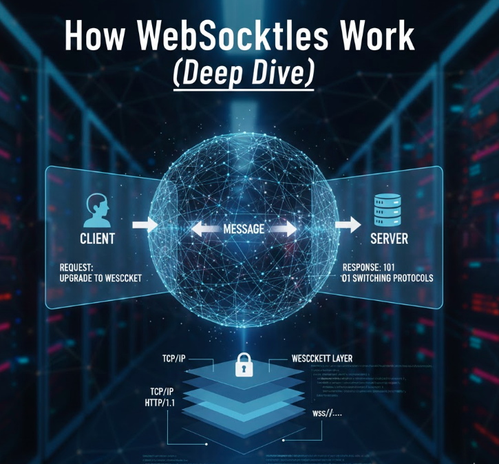

WebSockets are often described as “a persistent connection between client and server”, but that definition hides most of the complexity and the real power behind the protocol.

In this **How WebSockets Work deep dive**, I want to go beyond surface level explanations and break down what actually happens at the protocol, infrastructure, and architectural level. This perspective comes from building **Ressonance**, an open source WebSocket as a Service platform, and seeing firsthand where teams struggle when moving from request based systems to real time communication.

If you are building dashboards, notifications, collaborative tools, or any system that depends on **real time communication**, understanding how WebSockets really work is not optional.

<!-- truncate -->

---

## Why WebSockets Exist (and Why HTTP Was Not Enough)

HTTP was designed for a simple pattern: request, response, close connection.

This works great for documents, APIs, and most CRUD operations. It breaks down when applications need:

- Instant updates
- Bidirectional communication
- Low latency message delivery
- High frequency events

Polling was the first workaround. Clients would ask the server “anything new?” every few seconds. This creates unnecessary load and latency.

According to industry benchmarks, real time features can reduce perceived latency by more than 50 percent compared to polling based approaches in interactive applications.

WebSockets solve this by keeping a single TCP connection open and allowing both sides to push data at any time.

---

## The WebSocket Handshake Step by Step

Despite being a different protocol, WebSockets start their life as a normal HTTP request.

1. The client sends an HTTP request with an `Upgrade: websocket` header.
2. The server validates the request and agrees to upgrade the connection.
3. The server responds with `101 Switching Protocols`.
4. The connection is no longer HTTP. It becomes a WebSocket connection.

This handshake is critical because it allows WebSockets to work over standard ports (80 and 443) and pass through most firewalls and proxies.

Once the upgrade is complete, HTTP rules no longer apply.

---

## What Really Happens After the Connection Is Open

After the handshake, the connection becomes a full duplex channel over TCP.

This means:

- The server can push messages without a client request
- The client can send messages at any time
- Messages are framed, not streamed like HTTP responses
- The connection stays open until one side closes it

Each message is sent as a frame, which includes metadata like opcode and payload length. This framing allows efficient parsing and low overhead compared to repeated HTTP requests.

This is why WebSockets feel “instant”. There is no connection setup cost for each message.

---

## WebSockets vs Polling and SSE

It is important to understand where WebSockets fit compared to other real time techniques. Here's a quick breakdown about it, but we have a full article about it [here](http://localhost:3000/sse-vs-websockets)

### Polling
- Simple to implement
- High latency
- Wastes server resources
- Does not scale well

### Server Sent Events (SSE)
- One directional (server to client)
- Built on top of HTTP
- Easier to debug
- Not suitable for bidirectional interactions

### WebSockets
- Full duplex communication
- Low latency
- Efficient for high frequency events
- More complex to operate at scale

If your application needs true real time interaction, WebSockets are usually the correct choice.

---

## Common Architectural Mistakes with WebSockets

Teams new to WebSockets often repeat the same mistakes:

- Treating WebSockets like HTTP controllers
- Performing heavy business logic on the connection thread
- Not handling reconnects and dropped connections
- Forgetting about horizontal scaling
- Storing state only in memory

WebSockets force you to think in terms of events and messages, not requests and responses.

---

## Scaling WebSockets in Production

This is where most tutorials stop and real systems begin.

Scaling WebSockets requires solving problems like:

- Load balancing sticky connections
- Broadcasting messages across multiple servers
- Handling millions of concurrent connections
- Observability and debugging
- Graceful restarts and deployments

This is why many teams struggle when moving WebSockets to production.

Ressonance abstracts these concerns by providing a managed and open source friendly way to run WebSockets without reinventing infrastructure primitives.

---

## Where Ressonance Fits In

**Ressonance** is a WebSocket as a Service platform built for developers who want real time features without operational pain.

It offers:

- A generous free tier to get started
- First class Laravel support
- An open source core you can self host
- Simple setup using Docker
- A cloud option when you do not want to manage infrastructure

If you already understand how WebSockets work, Ressonance lets you focus on product instead of plumbing.

---

## Conclusion

Understanding **how WebSockets work** at a deeper level changes how you design real time systems. It helps you avoid architectural traps, scale with confidence, and choose the right tools for the job.

If you are building real time features today, WebSockets are a powerful foundation. And if you want to use them without the usual complexity, **Ressonance** offers a free tier to help you move fast.

[Create your free account and start building real-time features with confidence](https://ressonance.com)

---